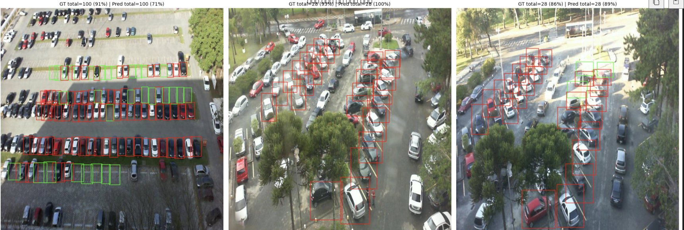

# ParkCast Vision

> CCTV/항공 이미지에서 주차장 빈 공간을 실시간으로 검출하는 컴퓨터비전 시스템.
> 한 장의 주차장 이미지를 입력하면 모든 주차칸의 위치 + 점유 여부 + 전체 점유율을 한 번에 출력함.



---

## 한 줄 요약

YOLOv8 기반으로 PKLot 데이터셋(12,416장, 약 70만 박스)을 학습하여 mAP50 **0.9944**, 점유율 추정 평균 오차 **0.27%p**를 달성한 end-to-end detection 시스템임.

---

## 왜 이 프로젝트인가

도심 주차난은 차량이 빈 공간을 찾아 헤매며 발생하는 공회전·정체로 이어짐. CCTV 영상에서 주차장 점유 상태를 정확히 파악할 수만 있어도 운전자에게 "어디에 자리가 있는지" 안내할 수 있음. 이 프로젝트는 그 첫 단계인 **시각 인식 모듈**을 끝까지 구현한 결과임.

원래는 [딥러닝 기반 주차 수요 예측 + 자동 배차 시스템(ParkCast)](docs/ParkCast_Proposal.pdf)이라는 더 큰 시스템의 일부로 기획됐으나, 수요 예측·경로 추천 부분은 실제 학습 가능한 데이터가 부족하다고 판단하여 **시각 인식 모듈에 집중**해서 구현함. 시스템 비전은 PDF 보고서로 남겨두고 코어를 완성한 형태.

---

## 결과 요약

### Test set 성능 (PKLot, Roboflow v2 random split)

| Metric | Score |
|---|---|
| mAP50 | **0.9944** |
| mAP50-95 | 0.9886 |
| Precision | 0.9977 |
| Recall | 0.9975 |

### 점유율 추정 정확도 (테스트 200장 샘플)

| Metric | Value |
|---|---|
| 평균 박스 카운트 오차 | 0.03 boxes |
| 평균 점유율 오차 | 0.27 %p |

평균적으로 한 장당 28~70개 칸 중 0.03칸만 틀림. 실용적으로는 거의 정확함.

### 실패 케이스

가장 점유율 추정이 어긋난 사례 6장을 분석한 결과, 공통 원인은 다음과 같았음:
- **트럭/SUV처럼 한 칸을 넘어선 차량**이 두 박스로 잘못 검출됨
- **나무 그림자가 칸을 가리는 경우** 빈 칸을 찬 칸으로 오인
- **원경의 작은 박스**(촬영 시점에서 멀리 있는 칸)에서 누락 발생

자세한 시각화는 `results/failure_cases.png` 참조.

> ⚠️ **Random split의 한계**: PKLot Roboflow v2는 5분 간격 연속 촬영 이미지를 random split했기 때문에, 사실상 거의 동일한 시점의 이미지가 train/test에 섞여 있음. 즉 0.99의 mAP는 *진짜 일반화 성능*이 아님. 이 한계를 검증하기 위한 cross-lot 평가 로직은 [`notebooks/ParkCast_Week2_CrossDomain.ipynb`](notebooks/ParkCast_Week2_CrossDomain.ipynb)에서 설계했고 [`parkcast/domain.py`](parkcast/domain.py) + [`scripts/cross_lot_eval.py`](scripts/cross_lot_eval.py)로 재사용 가능하게 정리함 — 코드는 완성됐지만 **실제 학습·평가는 아직 실행 전**(GPU 필요, Colab에서 실행 예정). 실행되면 이 섹션의 mAP 0.9944는 random split 결과라는 전제하에 date/lot split 결과와 나란히 갱신할 것.

---

## 기술 스택

| 분류 | 기술 |
|---|---|
| 모델 | YOLOv8n detect / YOLOv8n-seg (Ultralytics) |
| 학습 | PyTorch, transfer learning from COCO |
| 데이터 | PKLot v2 (Roboflow, COCO format → YOLO format/YOLO-seg format 자체 변환) |
| 자동 라벨링 | SAM(mobile_sam/sam_b, Ultralytics 통합) box-prompted segmentation + cv2.findContours/approxPolyDP |
| 도메인 갭 분석 | ResNet50 임베딩 + scikit-learn K-Means/PCA + UMAP |
| VLM 질의 | CLIP (`transformers`, zero-shot 이미지-텍스트 매칭) |
| 시각화 | matplotlib, OpenCV |
| 배포 | Gradio (로컬 웹 데모), HuggingFace Spaces (예정) |
| 인프라 | Google Colab (T4 GPU) |

---

## 프로젝트 구조

```
parkcast/
├── parkcast/                     ← import 가능한 라이브러리
│   ├── data.py                   COCO ↔ YOLO 변환(detect) + COCO ↔ YOLO-seg 변환(segment)
│   ├── eda.py                    분포·샘플 시각화
│   ├── train.py                  YOLOv8 학습 wrapper (detect/seg 공용 — checkpoint로 task 결정)
│   ├── inference.py              OccupancyPredictor (단일 이미지 → 점유율, seg면 마스크도 반환)
│   ├── evaluate.py               test mAP(+seg mAP) + GT 비교 + 실패 케이스 추출
│   ├── visualize.py               박스/폴리곤 그리기, 실패 그리드, YOLO-seg 라벨 검증 시각화
│   ├── domain.py                 cross-lot 도메인 갭 평가 (임베딩 클러스터링, split 구성)
│   ├── sam_label.py               SAM box-prompted 자동 라벨링 (진짜 픽셀 단위 마스크 → polygon)
│   ├── vlm.py                    CLIP 기반 open-vocabulary 질의 (ParkingVLM)
│   └── utils.py                  config 로딩, seed, 클래스 헬퍼
│
├── scripts/                      ← 한 줄로 돌릴 수 있는 진입점
│   ├── prepare_data.py           COCO → YOLO 변환 (config의 task로 detect/segment 분기)
│   ├── run_eda.py                EDA 그림 저장
│   ├── train.py                  학습 실행
│   ├── evaluate.py               평가 + 실패 분석
│   ├── predict.py                단일 이미지 추론
│   ├── cross_lot_eval.py         Random vs Date vs Lot split 비교 (도메인 갭 정량화)
│   └── sam_auto_label.py         SAM으로 YOLO-seg 데이터셋 자동 라벨링 (configs/segment.yaml 사용)
│
├── app/
│   ├── gradio_demo.py            웹 데모 (Detection 탭 + VLM 질의 탭)
│   └── hf_space/                 HuggingFace Spaces 배포용 (app.py, requirements.txt, README.md)
│
├── configs/
│   ├── default.yaml              detect(YOLOv8n) 하이퍼파라미터
│   └── segment.yaml              segment(YOLOv8n-seg) 하이퍼파라미터
│
├── notebooks/                    ← 실험 노트북 (재현용)
│   ├── ParkCast_Week1_YOLOv8.ipynb          실행 완료 (mAP50 0.9944)
│   └── ParkCast_Week2_CrossDomain.ipynb     코드 작성만 완료, 미실행 — scripts/cross_lot_eval.py로 대체
│
├── docs/
│   └── ParkCast_Proposal.pdf     원래 시스템 비전 (수요 예측 + 배차 추천)
│
├── requirements.txt
└── README.md
```

설계 원칙은 두 개임:
1. **`parkcast/`는 import만으로 재사용 가능**해야 함 (스크립트와 무관하게 동작).
2. **`scripts/`는 한 줄짜리 CLI**로, config 하나만 바꾸면 다른 데이터/하이퍼파라미터에서도 그대로 돌아감.

---

## 빠르게 돌려보기

### 1. 환경 설정

```bash
git clone https://github.com/<your-handle>/parkcast.git
cd parkcast
pip install -r requirements.txt
```

### 2. 데이터 준비

PKLot v2 (Roboflow)를 받아 `/content/`(또는 `configs/default.yaml`의 `raw_root`)에 풀어두면 다음 구조가 됨:

```
raw_root/
├── train/{images, _annotations.coco.json}
├── valid/{images, _annotations.coco.json}
└── test/{images, _annotations.coco.json}
```

### 3. 한 줄씩 실행 (detect, 기존 파이프라인)

```bash
# COCO → YOLO 변환
python scripts/prepare_data.py

# EDA 시각화
python scripts/run_eda.py

# 학습 (T4에서 약 40~60분)
python scripts/train.py

# 평가 + 실패 케이스 추출
python scripts/evaluate.py --weights runs/yolov8n_pklot_v1/weights/best.pt

# 단일 이미지 점유율 예측
python scripts/predict.py --weights runs/yolov8n_pklot_v1/weights/best.pt \
                         --image my_parking_lot.jpg \
                         --save output.png

# 웹 데모 실행 (Detection 탭 + VLM 질의 탭)
python app/gradio_demo.py --weights runs/yolov8n_pklot_v1/weights/best.pt --share
```

### 3-1. Instance Segmentation (YOLOv8n-seg)로 대신 돌리기

라벨 소스는 두 가지 — (A) 빠른 baseline, (B) 실제로 쓰는 SAM 자동 라벨링. 설계는
[`configs/segment.yaml`](configs/segment.yaml) 참조. 둘 다 같은 `yolo_root`에 저장되므로
아래 학습/평가 명령은 방법과 무관하게 동일함:

```bash
# (A) 빠른 baseline — COCO segmentation 필드 그대로/bbox fallback, GPU 불필요
python scripts/prepare_data.py --config configs/segment.yaml

# (B) 실제로 쓰는 방법 — SAM box-prompted 자동 라벨링 (GPU 필요)
python scripts/sam_auto_label.py --config configs/segment.yaml

# 라벨 검증 (SAM 결과가 각진 사각형이 아니라 진짜 윤곽인지 눈으로 확인)
python -c "
from parkcast.visualize import plot_yolo_seg_label_sample
plot_yolo_seg_label_sample('pklot_yolo_seg/train/images/<파일명>.jpg',
                            'pklot_yolo_seg/train/labels/<파일명>.txt',
                            ['spaces', 'space-empty', 'space-occupied'],
                            save_path='seg_label_check.png', show=False)
"

# 학습 + 평가 (box mAP와 mask mAP 둘 다 리포트)
python scripts/train.py    --config configs/segment.yaml
python scripts/evaluate.py --config configs/segment.yaml --weights runs/yolov8n_seg_pklot_v1/weights/best.pt
```

### 3-2. Cross-lot(도메인 갭) 평가

기존 random split 결과를 인자로 넘기면 Date split / Lot split을 새로 만들어 학습·평가하고
셋을 비교함 (`parkcast/domain.py` + `scripts/cross_lot_eval.py`, 아직 실행 전 — GPU 필요):

```bash
python scripts/cross_lot_eval.py --config configs/default.yaml \
    --random-map50 0.9944 --random-map50-95 0.9886 \
    --random-precision 0.9977 --random-recall 0.9975
```

### 4. 라이브러리로 사용

```python
from parkcast.inference import OccupancyPredictor

pred = OccupancyPredictor("models/best.pt")
result = pred.predict("my_lot.jpg", conf=0.4)

print(f"빈 칸: {result.n_empty}")
print(f"찬 칸: {result.n_occupied}")
print(f"점유율: {result.occupancy_pct:.1f}%")
```

---

## 설계 결정 / 트레이드오프

이 섹션이 면접에서 받을 만한 질문에 대한 답임.

### 왜 YOLOv8n인가? (S/M/L 안 쓴 이유)

PKLot의 박스가 한 이미지당 30~70개로 dense하지만 박스 자체는 단순한 직사각형이고 클래스가 2개뿐임. 표현력보다는 **추론 속도**가 더 중요한 응용임 (실시간 CCTV). YOLOv8n으로도 mAP50 0.99가 나오는데 굳이 무거운 모델을 쓸 이유가 없음. 만약 cross-domain 성능이 부족하면 그때 YOLOv8s로 올려서 비교할 계획임.

### 왜 fliplr=0.0 (좌우반전 끔)인가?

PKLot CCTV는 카메라가 고정되어 있어서 좌우반전을 적용하면 학습 분포와 실제 추론 분포가 어긋남. 같은 이유로 강한 회전(`degrees`)도 끔. **데이터의 도메인 특성을 반영한 증강 설계**임.

### 점유율 추정이 0.27%p로 정확한 이유

mAP는 위치+클래스 모두 맞춰야 하지만, 점유율은 **카운트 차이만** 보면 됨. 그래서 박스가 약간 어긋나도(IoU가 낮아도) 카운트는 맞음. mAP보다 더 관대한 metric이라 0.27%p가 실제 응용 정확도에 더 가까움.

### Roboflow random split의 한계 인지

PKLot Roboflow v2는 5분 간격 사진을 random split해서, 사실상 **train과 test가 거의 같은 이미지**가 들어감. mAP 0.99가 그대로 진짜 일반화 성능이 아님. 이 한계를 직접 검증하기 위해 (1) date split, (2) 이미지 임베딩 클러스터링 기반 cross-lot split 두 가지로 다시 평가하는 로직을 `parkcast/domain.py`에 구현함(실행은 아직).

### 왜 YOLOv8n-seg로 확장하는가? + 라벨은 어디서 얻는가

PKLot 주차칸은 카메라 각도상 회전된 사각형(quadrilateral)으로 찍히는 경우가 많음. axis-aligned bbox는 이런 칸을 감쌀 때 인접 칸과 겹치는 여유 영역을 과대 포함하게 됨.

문제는 라벨 소스: PKLot의 COCO `segmentation` 필드는 있어도 bbox에서 파생된 사각형뿐이라, 그대로 쓰면 "각진 사각형" 마스크만 나옴(진짜 윤곽이 아님). 그래서 두 가지 방법을 다 구현해둠:

1. **`parkcast/data.py::coco_to_yolo_seg`** — COCO segmentation 필드를 그대로 쓰고 없으면 bbox 4꼭짓점 fallback. GPU 불필요, 빠름. 학습 파이프라인을 깨지지 않게 만드는 baseline 용도.
2. **`parkcast/sam_label.py`(실제로 쓰는 방법)** — 이미 검증된 YOLOv8n GT bbox를 [SAM(Segment Anything)](https://github.com/ultralytics/ultralytics)의 box prompt로 넣어 픽셀 단위 마스크를 뽑고, `cv2.findContours` + `cv2.approxPolyDP`로 정리된 polygon으로 단순화함. Ultralytics에 SAM이 통합돼 있어(`from ultralytics import SAM`) 추가 설치 부담이 거의 없음. 마스크를 못 뽑는 극히 드문 경우엔 bbox 4꼭짓점으로 fallback하고 `SamLabelingStats`에 정직하게 카운트함.

`scripts/sam_auto_label.py`로 뽑은 라벨은 `parkcast/visualize.py::plot_yolo_seg_label_sample`로 직접 그려서 "각진 사각형이 아니라 진짜 윤곽인지" 학습 전에 눈으로 검증함 — 실제 사진(사람/버스)으로 로컬 테스트했을 때 몸/버스 윤곽을 그대로 따라가는 것을 확인함(합성 테스트, PKLot 실데이터 라벨링은 아직 미실행).

---

## 고도화 로드맵

Week 1(아래 표) 이후 4가지 방향으로 확장 중 — **표시는 코드 작성 여부이지 실행/검증 여부가 아님**(GPU 학습은 Colab에서 진행 예정):

| 단계 | 내용 | 상태 |
|---|---|---|
| 1. Instance Segmentation | YOLOv8n-seg 전환. 라벨은 SAM box-prompted 자동 라벨링(`parkcast/sam_label.py`, GT bbox → SAM → `cv2.findContours`+`approxPolyDP` polygon, 실패 시 bbox fallback)이 실제 방법이고, `coco_to_yolo_seg`(COCO segmentation 필드/bbox fallback)는 GPU 없이 도는 baseline. `inference.py`/`evaluate.py`/`visualize.py`도 마스크 지원 | 코드 작성 완료(SAM 파이프라인은 실제 사진으로 로컬 검증), PKLot 실데이터 라벨링·학습 실행 전 |
| 2. HuggingFace Spaces 배포 | `app/hf_space/` (Spaces용 `app.py` + YAML front matter README) | 코드 작성 완료, 실제 push/배포 전 |
| 3. Cross-lot 평가 | `parkcast/domain.py` + `scripts/cross_lot_eval.py` — ResNet50 임베딩 클러스터링으로 주차장 자동 발견 → Random/Date/Lot split 비교 | 코드 작성 완료(Week2 노트북 설계를 모듈화), 실행 전 |
| 4. CLIP 기반 VLM 질의 | `parkcast/vlm.py`(`ParkingVLM`) + `gradio_demo.py`의 "VLM 질의" 탭 — 차종 추정, 자유 텍스트 질의 | 코드 작성 완료, 실행 검증은 로컬 통합 테스트만(transformers 미설치 환경) |

- [x] **Week 1**: YOLOv8 베이스라인 학습 + 단일 이미지 점유율 추정 (실행 완료, mAP50 0.9944)
- [ ] **Week 2 이후**: 위 4단계 순서대로 Colab에서 실제 학습·평가하고 결과를 이 README/포트폴리오에 반영

---

## 데이터셋

**PKLot** (Federal University of Paraná, Brazil)
- 12,416장의 주차장 항공 이미지 (3개 주차장 × 3개 날씨)
- 약 70만 개의 주차칸 어노테이션 (occupied/empty)
- License: CC BY 4.0
- 출처: [Roboflow PKLot v2](https://public.roboflow.ai/object-detection/pklot)

```
Almeida, P., Oliveira, L. S., Silva Jr, E., Britto Jr, A., Koerich, A.,
PKLot – A robust dataset for parking lot classification,
Expert Systems with Applications, 42(11):4937-4949, 2015.
```

---

## 참고문헌 / 관련 연구

이 프로젝트의 시스템 비전(ParkCast 전체)은 다음 연구를 조합한 것임. 본 레포는 이 중 (1) 시각 인식 모듈을 실제로 구현한 것임.

1. 실내 주차장 차량 위치 추정 시스템 (YOLOv4 + NVDCF Tracker + 다중 호모그래피)
2. CNN + Conv-LSTM + LSTM 기반 시공간 주차 수요 예측
3. Reeds-Shepp Curve + Hybrid A* 기반 주차 경로 생성

자세한 시스템 설계는 [`docs/ParkCast_Proposal.pdf`](docs/ParkCast_Proposal.pdf) 참조.

---

## License

코드: MIT
데이터셋: CC BY 4.0 (PKLot)
