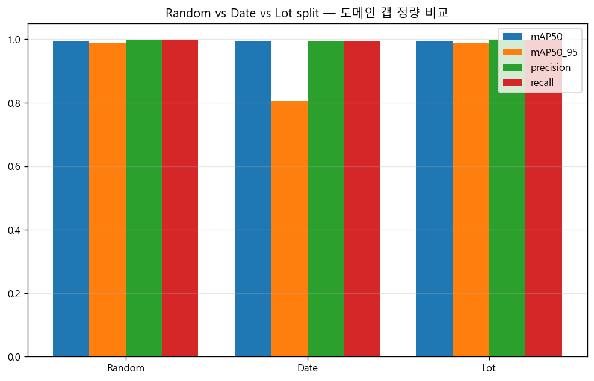
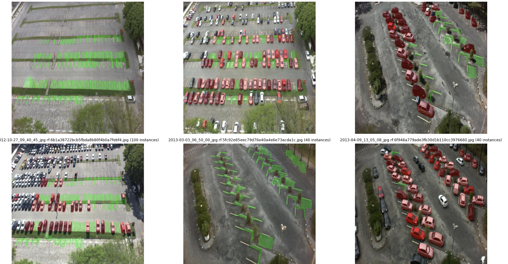
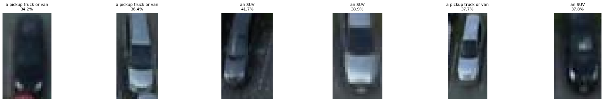
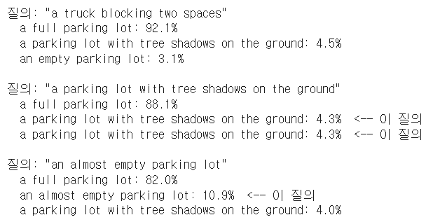
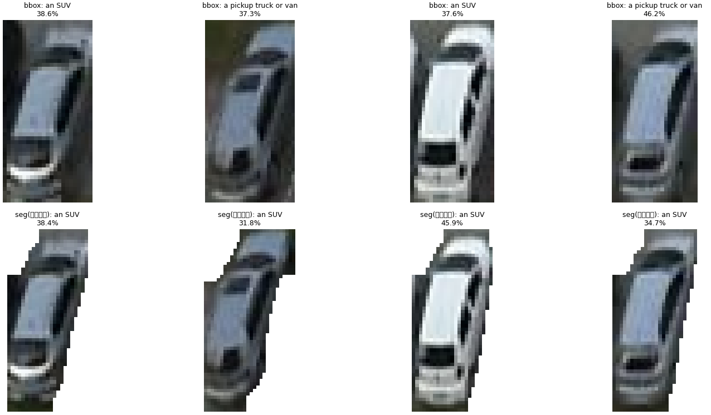

# ParkCast Vision

> CCTV/항공 이미지에서 주차장 빈 공간을 실시간으로 검출하는 컴퓨터비전 시스템.
> 한 장의 주차장 이미지를 입력하면 모든 주차칸의 위치 + 점유 여부 + 전체 점유율을 한 번에 출력함.


---

## 한 줄 요약

YOLOv8 기반으로 PKLot 데이터셋(12,416장, 약 70만 박스)을 학습하여 mAP50 **0.9944**, 점유율 추정 평균 오차 **0.27%p**를 달성한 end-to-end detection 시스템임.

---

## 왜 이 프로젝트인가

도심 주차난은 차량이 빈 공간을 찾아 헤매며 발생하는 공회전·정체로 이어짐. CCTV 영상에서 주차장 점유 상태를 정확히 파악할 수만 있어도 운전자에게 "어디에 자리가 있는지" 안내할 수 있음. 이 프로젝트는 그 첫 단계인 **시각 인식 모듈**을 끝까지 구현한 결과임.

원래는 [딥러닝 기반 주차 수요 예측 + 자동 배차 시스템(ParkCast)](docs/ParkCast_Proposal.pdf)이라는 더 큰 시스템의 일부로 기획됐으나, 수요 예측·경로 추천 부분은 실제 학습 가능한 데이터가 부족하다고 판단하여 **시각 인식 모듈에 집중**해서 구현함. 시스템 비전은 PDF 보고서로 남겨두고 코어를 완성한 형태.

---

## 결과 요약

### Test set 성능 (PKLot, Roboflow v2 random split)

| Metric | Score |
|---|---|
| mAP50 | **0.9944** |
| mAP50-95 | 0.9886 |
| Precision | 0.9977 |
| Recall | 0.9975 |

### 점유율 추정 정확도 (테스트 200장 샘플)

| Metric | Value |
|---|---|
| 평균 박스 카운트 오차 | 0.03 boxes |
| 평균 점유율 오차 | 0.27 %p |

평균적으로 한 장당 28~70개 칸 중 0.03칸만 틀림. 실용적으로는 거의 정확함.

### 실패 케이스

가장 점유율 추정이 어긋난 사례 6장을 분석한 결과, 공통 원인은 다음과 같았음:
- **트럭/SUV처럼 한 칸을 넘어선 차량**이 두 박스로 잘못 검출됨
- **나무 그림자가 칸을 가리는 경우** 빈 칸을 찬 칸으로 오인
- **원경의 작은 박스**(촬영 시점에서 멀리 있는 칸)에서 누락 발생

자세한 시각화는 `results/failure_cases.png` 참조.

> ⚠️ **Random split의 한계**: PKLot Roboflow v2는 5분 간격 연속 촬영 이미지를 random split했기 때문에, 사실상 거의 동일한 시점의 이미지가 train/test에 섞여 있음. 즉 0.99의 mAP는 *진짜 일반화 성능*이 아닐 수 있다는 의심을 실제로 검증함 — 결과는 아래 "Cross-lot 도메인 갭 평가 결과 (Week 2)" 섹션 참조. 결론만 먼저 말하면: **"cross-domain 검증 성공"이 아니라, 임베딩 기반 클러스터링이 주차장을 제대로 분리하지 못한 네거티브 결과**였고, Date split의 mAP50-95 하락만 유의미한 신호로 확인됨.

---

## Cross-lot 도메인 갭 평가 결과 (Week 2)

원래 계획했던 "Week 2: cross-lot 일반화 평가"를 실제로 Colab에서 실행한 결과(`notebooks/ParkCast_Week2_CrossLot.ipynb`, 로직은 [`parkcast/domain.py`](parkcast/domain.py) + [`scripts/cross_lot_eval.py`](scripts/cross_lot_eval.py)). Week 1의 mAP 0.9944가 random split의 data leakage 때문일 수 있다는 의심을 검증하기 위해, ResNet50 임베딩 + K-Means로 주차장을 라벨 없이 자동 발견하고, 같은 데이터를 Random/Date/Lot 세 가지 split으로 나눠 비교함.

### 도메인 자동 발견 결과

K-Means로 최적 클러스터 수를 탐색한 결과 **best_k=6, silhouette=0.2347**. PKLot의 실제 주차장 수는 3개(PUCPR/UFPR04/UFPR05)인데, 클러스터 수가 그보다 많이 나왔고 silhouette score도 0.23으로 낮음 — 임베딩이 주차장 정체성보다 조명·구도 같은 저수준 특징에 더 지배됐을 가능성을 시사함.

### Split별 결과 (test set)

Lot split 크기: train 9,842 / val 1,093 / test 1,481

| Split | mAP50 | mAP50-95 | Precision | Recall |
|---|---|---|---|---|
| Random | 0.9944 | 0.9886 | 0.9977 | 0.9975 |
| Date | 0.995 | 0.805 | ~0.995 | ~0.995 |
| Lot | 0.995 | 0.989 | 0.999 | 0.998 |

Date/Lot의 정확한 소수점은 `results/cross_lot/split_comparison.csv` 참조(위 표는 Colab 로그에서 옮긴 값).

<!-- 여기에 results/cross_lot/split_comparison.png 캡처를 넣으면 됨 (Random/Date/Lot 3-way 비교 막대그래프) -->


### 이 결과의 의미 — 네거티브 결과임, "도메인 갭 없음"이 아니라 "분리가 안 됨"

세 split의 mAP50이 전부 0.99대로 거의 동일한 것은 **도메인 갭이 없어서가 아니라, K-Means 클러스터링이 물리적 주차장을 제대로 분리하지 못했기 때문**임. best_k=6이 실제 주차장 수(3)보다 많이 나온 것 자체가 그 증거 — 같은 주차장이 날씨·조명별로 서로 다른 클러스터로 쪼개진 것으로 보임. 그 결과 "Lot split"의 train/val/test에 사실상 같은 주차장이 섞여 들어가, 의도와 달리 또 하나의 random split이 되어버렸고, 이게 mAP50이 떨어지지 않은 진짜 이유임.

다만 **Date split의 mAP50-95가 0.9886 → 0.805로 떨어진 것은 유의미한 신호**임. mAP50-95는 IoU 기준이 엄격한 구간까지 평균낸 지표라, 시간적으로 학습/테스트를 분리하면(다른 날짜) 박스 위치를 정밀하게 맞추는 능력이 나빠진다는 걸 보여줌 — random split이 갖고 있던 leakage(같은 시점 사진이 train/test 양쪽에 들어가는 것)를 부분적으로 제거한 효과로 해석됨.

**결론**: 이 실험은 "cross-domain 검증에 성공했다"는 게 아니라, **임베딩 기반 비지도 도메인 분리 방법의 한계**를 보여준 네거티브 결과임. 그럼에도 (1) mAP 0.99가 leakage 때문일 수 있다는 의심을 실제로 검증하려 했고, (2) 그 과정에서 클러스터링이 실패했다는 것 자체를 진단해냈고, (3) Date split을 통해 최소한 시간적 leakage의 영향은 정량적으로 확인했다는 점이 이 실험의 핵심 기여임. 다음 단계로는 더 lot-특이적인 피처(예: 고정 배경 영역만 crop한 임베딩)를 시도해볼 수 있음.

---

## Instance Segmentation 결과 (Week 3 — SAM 자동 라벨링 → YOLOv8n-seg)

Week 1(bbox detection) 이후 실제로 Colab에서 돌려서 얻은 결과. GT bbox를 SAM(Segment Anything)의 box prompt로 넣어 픽셀 단위 마스크를 얻고(`scripts/sam_auto_label.py`), 리소스 제약을 감안해 서브셋(train 2,000 / valid 300 / test 300, `configs/segment.yaml` 참조)으로 YOLOv8n-seg를 학습함.

### 라벨 품질 검증

`parkcast/visualize.py::plot_yolo_seg_label_sample`로 SAM이 뽑은 라벨을 직접 그려본 것 — 각진 bbox가 아니라 차량 윤곽을 따라가는 polygon임을 확인함.



### Test set 성능 (서브셋, box + mask 둘 다 리포트)

| Metric | Score |
|---|---|
| mAP50 (box) | 0.9613 |
| mAP50-95 (box) | 0.7757 |
| Precision | 0.9381 |
| Recall | 0.9335 |
| **Mask mAP50** | **0.9263** |
| **Mask mAP50-95** | **0.5639** |

### 점유율 추정 정확도 (테스트 193장 샘플)

| Metric | Value |
|---|---|
| 평균 박스 카운트 오차 | 1.24 boxes |
| 평균 점유율 오차 | 0.60 %p |

### Detect(bbox) baseline 대비 — 왜 떨어졌는가

| Metric | Detect (전체 8,691장) | Seg (서브셋 2,000장) |
|---|---|---|
| mAP50 | 0.9944 | 0.9613 |
| mAP50-95 | 0.9886 | 0.7757 (box) |
| 평균 점유율 오차 | 0.27 %p | 0.60 %p |

수치만 보면 하락했지만 원인이 명확함: **학습 데이터가 전체의 23%(2,000/8,691장)뿐**이고, seg 모델은 box head와 mask head를 같은 backbone으로 동시에 학습하는 multi-task라 같은 epoch(30)로는 detect 전용 모델만큼 수렴하지 못함. 특히 mAP50-95(높은 IoU 기준까지 정밀하게 맞아야 함)가 mAP50보다 더 크게 떨어진 것도 같은 이유 — "칸을 찾았는지"는 거의 detect만큼 잘하지만 "경계를 얼마나 정밀하게 맞췄는지"는 데이터 부족의 영향을 더 받음. Mask mAP50-95(0.5639)가 box mAP50-95(0.7757)보다 낮은 것도 예상된 결과: `mobile_sam`(가장 가벼운 SAM 변형)의 마스크 정밀도 + `approxPolyDP` 단순화 과정에서 경계 정보 일부 손실. 그래도 점유율 오차 0.60%p는 여전히 실용적 수준임.

**다음 개선 방향**: 서브셋 크기를 늘리거나(`configs/segment.yaml`의 `sam_labeling.subset`), `mobile_sam.pt` 대신 `sam_b.pt`/`sam2_b.pt`로 교체해 마스크 정밀도를 높이는 것으로 mAP50-95 격차를 좁힐 수 있을 것으로 예상함(아직 실험 전).

---

## CLIP 기반 VLM 질의 결과 (Week 4)

`notebooks/ParkCast_Week4_VLM.ipynb`를 Colab에서 실제로 실행한 결과(`parkcast/vlm.py`의 `ParkingVLM`). 3개 데모 중 하나는 뚜렷한 한계를 그대로 드러냈고, 하나는 가설이 검증되지 않은 네거티브 결과였음 — 있는 그대로 기록함.

### Demo 1 — Zero-shot 차종 분류

Week 1 bbox 모델로 검출한 점유 칸을 crop해서 CLIP으로 sedan/SUV/pickup truck/motorcycle 4지선다 분류.

<!-- 여기에 Demo 1 결과 캡처(vlm_demo1_vehicle_classification.png)를 넣으면 됨 -->


확신도가 34.2~41.7%로 낮음(4지선다 랜덤 추측이 25%이므로 그보다는 높지만, 확신 있는 수준은 아님). 6개 샘플 모두 "an SUV" 또는 "a pickup truck or van"으로만 분류되고 "a sedan car"·"a motorcycle"은 한 번도 1위로 안 나옴 — PKLot 항공뷰의 저해상도 crop에서 CLIP의 차종 구분력이 제한적이거나, 후보 문구 설계가 항공뷰에 최적화되지 않았을 가능성을 시사함(추가 검증 필요).

### Demo 2 — 자연어 질의

<!-- 여기에 Demo 2 결과 캡처(vlm_demo2_natural_language_query.png)를 넣으면 됨 -->


| 질의 | "a full parking lot" | 실제 질의 텍스트 |
|---|---|---|
| "a truck blocking two spaces" | 92.1% | 3.1% 미만(상위 3위 밖) |
| "a parking lot with tree shadows on the ground" | 88.1% | 4.3% |
| "an almost empty parking lot" | 82.0% | 10.9% |

**명확한 한계가 드러남**: 세 질의 모두 실제 입력한 텍스트와 무관하게 "a full parking lot"(기본 후보 중 하나)이 압도적으로 1위를 차지함. 이미지 자체가 실제로 붐비는 주차장이라 CLIP의 전체 이미지 임베딩이 "붐빈다/비었다" 같은 전역적 특징에는 민감하지만, "트럭 한 대가 두 칸을 막고 있다"처럼 국소적이고 구체적인 내용에는 거의 반응하지 않음. `parkcast/vlm.py`에 이미 적어둔 "CLIP은 VQA가 아니라 이미지-텍스트 유사도 모델"이라는 한계가 실제 데모에서 그대로 확인된 것 — **전체 이미지에 대한 자유 질의는 기대만큼 유용하지 않았고, Demo 3처럼 관심 영역을 crop해서 질의하는 방식이 훨씬 안정적**임을 보여줌.

### Demo 3 — Seg + VLM 결합 (배경 제거 후 분류)

Week 3 seg 모델의 polygon 마스크로 배경을 지운 crop과, 기존 bbox crop을 같은 인스턴스에 대해 나란히 분류해서 비교함.

<!-- 여기에 Demo 3 결과 캡처(vlm_demo3_seg_vs_bbox_crop.png)를 넣으면 됨 -->


| 인스턴스 | bbox crop | seg crop(배경 제거) |
|---|---|---|
| 1 | SUV 38.6% | SUV 38.4% |
| 2 | pickup truck/van 37.3% | SUV(레이블 변화 없음) 31.8% |
| 3 | SUV 37.6% | SUV 45.9% |
| 4 | pickup truck/van 46.2% | SUV 34.7% |

**이번 소규모 샘플(4개)에서는 가설이 뚜렷하게 검증되지 않음**: 4개 인스턴스 모두 예측 라벨은 bbox/seg 사이에 (인스턴스 2를 제외하고) 동일했고, confidence도 개선되는 방향으로 일관되지 않음(3번은 seg가 더 높고, 2·4번은 오히려 seg가 더 낮음). "배경 노이즈를 지우면 분류가 더 정확해진다"는 가설을 이 샘플만으로는 뒷받침하지 못함 — `mobile_sam.pt`(가장 가벼운 SAM 변형)의 마스크 경계가 완벽하지 않아 seg crop 가장자리에도 약간의 배경/인접 차량 조각이 남아있는 것으로 보임. 표본을 늘리거나 정밀한 SAM 모델로 재검증이 필요함.

### 종합

3개 데모 중 자연어 질의(Demo 2)의 한계가 가장 뚜렷했고, seg+VLM 결합(Demo 3)의 이점은 이번 샘플에서는 확인되지 않았음. Zero-shot 차종 분류(Demo 1)는 방향은 맞지만 확신도가 낮아 실용적으로 쓰려면 후보 문구나 이미지 해상도 개선이 필요해 보임. CLIP을 그대로 붙이는 것만으로는 부족하고, **PKLot 항공뷰 도메인에 맞는 프롬프트/입력 전처리 튜닝이 다음 단계**로 필요함.

### 부록 — Gradio 데모에서 발견한 실제 도메인 갭 (PKLot 외부 이미지)

Gradio 데모를 실제로 띄운 뒤 PKLot 테스트셋이 아닌 외부 이미지(지도/위성 스크린샷, 도로가 함께 보이는 비스듬한 각도)를 넣어봤더니, 차량 30여 대가 있는 사진에서 YOLOv8n-seg가 **단 1대만 검출**함. 모델 버그가 아니라 **PKLot과 전혀 다른 촬영 각도·해상도·배경(도로, 횡단보도 등)의 도메인 갭**으로 해석됨 — Week 2에서 검증하려던 "같은 데이터셋 내 다른 주차장" 수준보다 훨씬 큰 도메인 차이임. Gradio UI(`app/gradio_demo.py`, `app/hf_space/app.py`)에 "PKLot 스타일 항공사진에서만 잘 동작함" 안내 문구를 추가해 실제 배포 시 방문자의 혼란을 줄임.

---

## 기술 스택

| 분류 | 기술 |
|---|---|
| 모델 | YOLOv8n detect / YOLOv8n-seg (Ultralytics) |
| 학습 | PyTorch, transfer learning from COCO |
| 데이터 | PKLot v2 (Roboflow, COCO format → YOLO format/YOLO-seg format 자체 변환) |
| 자동 라벨링 | SAM(mobile_sam/sam_b, Ultralytics 통합) box-prompted segmentation + cv2.findContours/approxPolyDP |
| 도메인 갭 분석 | ResNet50 임베딩 + scikit-learn K-Means/PCA + UMAP |
| VLM 질의 | CLIP (`transformers`, zero-shot 이미지-텍스트 매칭) |
| 시각화 | matplotlib, OpenCV |
| 배포 | Gradio (로컬 웹 데모), HuggingFace Spaces ([rlaxogus/Parkcast](https://huggingface.co/spaces/rlaxogus/Parkcast)) |
| 인프라 | Google Colab (T4 GPU) |

---

## 프로젝트 구조

```
parkcast/
├── parkcast/                     ← import 가능한 라이브러리
│   ├── data.py                   COCO ↔ YOLO 변환(detect) + COCO ↔ YOLO-seg 변환(segment)
│   ├── eda.py                    분포·샘플 시각화
│   ├── train.py                  YOLOv8 학습 wrapper (detect/seg 공용 — checkpoint로 task 결정)
│   ├── inference.py              OccupancyPredictor (단일 이미지 → 점유율, seg면 마스크도 반환)
│   ├── evaluate.py               test mAP(+seg mAP) + GT 비교 + 실패 케이스 추출
│   ├── visualize.py               박스/폴리곤 그리기, 실패 그리드, YOLO-seg 라벨 검증 시각화
│   ├── domain.py                 cross-lot 도메인 갭 평가 (임베딩 클러스터링, split 구성)
│   ├── sam_label.py               SAM box-prompted 자동 라벨링 (진짜 픽셀 단위 마스크 → polygon)
│   ├── vlm.py                    CLIP 기반 open-vocabulary 질의 (ParkingVLM)
│   └── utils.py                  config 로딩, seed, 클래스 헬퍼
│
├── scripts/                      ← 한 줄로 돌릴 수 있는 진입점
│   ├── prepare_data.py           COCO → YOLO 변환 (config의 task로 detect/segment 분기)
│   ├── run_eda.py                EDA 그림 저장
│   ├── train.py                  학습 실행
│   ├── evaluate.py               평가 + 실패 분석
│   ├── predict.py                단일 이미지 추론
│   ├── cross_lot_eval.py         Random vs Date vs Lot split 비교 (도메인 갭 정량화)
│   └── sam_auto_label.py         SAM으로 YOLO-seg 데이터셋 자동 라벨링 (configs/segment.yaml 사용)
│
├── app/
│   ├── gradio_demo.py            웹 데모 (Detection 탭 + VLM 질의 탭)
│   └── hf_space/                 HuggingFace Spaces 배포용 (app.py, requirements.txt, README.md)
│
├── configs/
│   ├── default.yaml              detect(YOLOv8n) 하이퍼파라미터
│   └── segment.yaml              segment(YOLOv8n-seg) 하이퍼파라미터
│
├── notebooks/                    ← 실험 노트북 (재현용)
│   ├── ParkCast_Week1_YOLOv8.ipynb          실행 완료 (mAP50 0.9944)
│   ├── ParkCast_Week2_CrossLot.ipynb        실행 완료 (네거티브 결과 — 위 섹션 참조)
│   └── ParkCast_Week4_VLM.ipynb             실행 완료 (자연어 질의 한계 확인 — 위 섹션 참조)
│
├── docs/
│   └── ParkCast_Proposal.pdf     원래 시스템 비전 (수요 예측 + 배차 추천)
│
├── requirements.txt
└── README.md
```

설계 원칙은 두 개임:
1. **`parkcast/`는 import만으로 재사용 가능**해야 함 (스크립트와 무관하게 동작).
2. **`scripts/`는 한 줄짜리 CLI**로, config 하나만 바꾸면 다른 데이터/하이퍼파라미터에서도 그대로 돌아감.

---

## 빠르게 돌려보기

### 1. 환경 설정

```bash
git clone https://github.com/<your-handle>/parkcast.git
cd parkcast
pip install -r requirements.txt
```

### 2. 데이터 준비

PKLot v2 (Roboflow)를 받아 `/content/`(또는 `configs/default.yaml`의 `raw_root`)에 풀어두면 다음 구조가 됨:

```
raw_root/
├── train/{images, _annotations.coco.json}
├── valid/{images, _annotations.coco.json}
└── test/{images, _annotations.coco.json}
```

### 3. 한 줄씩 실행 (detect, 기존 파이프라인)

```bash
# COCO → YOLO 변환
python scripts/prepare_data.py

# EDA 시각화
python scripts/run_eda.py

# 학습 (T4에서 약 40~60분)
python scripts/train.py

# 평가 + 실패 케이스 추출
python scripts/evaluate.py --weights runs/yolov8n_pklot_v1/weights/best.pt

# 단일 이미지 점유율 예측
python scripts/predict.py --weights runs/yolov8n_pklot_v1/weights/best.pt \
                         --image my_parking_lot.jpg \
                         --save output.png

# 웹 데모 실행 (Detection 탭 + VLM 질의 탭)
python app/gradio_demo.py --weights runs/yolov8n_pklot_v1/weights/best.pt --share
```

### 3-1. Instance Segmentation (YOLOv8n-seg)로 대신 돌리기

라벨 소스는 두 가지 — (A) 빠른 baseline, (B) 실제로 쓰는 SAM 자동 라벨링. 설계는
[`configs/segment.yaml`](configs/segment.yaml) 참조. 둘 다 같은 `yolo_root`에 저장되므로
아래 학습/평가 명령은 방법과 무관하게 동일함:

```bash
# (A) 빠른 baseline — COCO segmentation 필드 그대로/bbox fallback, GPU 불필요
python scripts/prepare_data.py --config configs/segment.yaml

# (B) 실제로 쓰는 방법 — SAM box-prompted 자동 라벨링 (GPU 필요)
python scripts/sam_auto_label.py --config configs/segment.yaml

# 라벨 검증 (SAM 결과가 각진 사각형이 아니라 진짜 윤곽인지 눈으로 확인)
python -c "
from parkcast.visualize import plot_yolo_seg_label_sample
plot_yolo_seg_label_sample('pklot_yolo_seg/train/images/<파일명>.jpg',
                            'pklot_yolo_seg/train/labels/<파일명>.txt',
                            ['spaces', 'space-empty', 'space-occupied'],
                            save_path='seg_label_check.png', show=False)
"

# 학습 + 평가 (box mAP와 mask mAP 둘 다 리포트)
python scripts/train.py    --config configs/segment.yaml
python scripts/evaluate.py --config configs/segment.yaml --weights runs/yolov8n_seg_pklot_v1/weights/best.pt
```

### 3-2. Cross-lot(도메인 갭) 평가 — 실행 완료 (네거티브 결과, 위 섹션 참조)

기존 random split 결과를 인자로 넘기면 Date split / Lot split을 새로 만들어 학습·평가하고
셋을 비교함 (`parkcast/domain.py` + `scripts/cross_lot_eval.py`). 실제 Colab 실행은
세션 끊김·Drive symlink 문제로 CLI 대신 [`notebooks/ParkCast_Week2_CrossLot.ipynb`](notebooks/ParkCast_Week2_CrossLot.ipynb)로 진행함 — 데이터는 로컬(`/content`)에 두고 결과만 Drive에 저장하는 방식이 안정적이었음. CLI로 동일 로직을 재현하려면:

```bash
python scripts/cross_lot_eval.py --config configs/default.yaml \
    --random-map50 0.9944 --random-map50-95 0.9886 \
    --random-precision 0.9977 --random-recall 0.9975
```

### 4. 라이브러리로 사용

```python
from parkcast.inference import OccupancyPredictor

pred = OccupancyPredictor("models/best.pt")
result = pred.predict("my_lot.jpg", conf=0.4)

print(f"빈 칸: {result.n_empty}")
print(f"찬 칸: {result.n_occupied}")
print(f"점유율: {result.occupancy_pct:.1f}%")
```

---

## 고도화 로드맵

원래 계획은 Week 1~4 순서였으나 실제로는 Week 3(Instance Segmentation)를 먼저 실행하고 Week 2(Cross-lot)를 나중에 실행함. 아래 표는 Week 번호(원래 계획 기준)로 정리:

| 단계 | 내용 | 상태 |
|---|---|---|
| Week 1 — Detection | YOLOv8n bbox 검출, 전체 데이터(train 8,691장) | ✅ **실행 완료** — mAP50 0.9944, 점유율 오차 0.27%p |
| Week 2 — Cross-lot 평가 | ResNet50 임베딩 + K-Means로 주차장 자동 발견 → Random/Date/Lot split 비교 (`parkcast/domain.py`, `scripts/cross_lot_eval.py`) | ✅ **실행 완료** — 네거티브 결과(클러스터링이 주차장을 못 분리함), Date split의 mAP50-95 하락만 유의미한 신호. 상세는 위 "Cross-lot 도메인 갭 평가 결과" 섹션 |
| Week 3 — Instance Segmentation | SAM box-prompted 자동 라벨링(`parkcast/sam_label.py`) → YOLOv8n-seg 학습, 서브셋(train 2,000장) | ✅ **실행 완료** — mAP50 0.9613 / Mask mAP50 0.9263, 상세는 위 "Instance Segmentation 결과" 섹션 |
| HuggingFace Spaces 배포 | `app/hf_space/` (Spaces용 `app.py` + YAML front matter README). Colab에서 `huggingface_hub`로 바로 업로드하는 배포 셀을 `ParkCast_Week4_VLM.ipynb`에 추가함(`app/hf_space/README.md` 참조) | ✅ **배포 완료** — [huggingface.co/spaces/rlaxogus/Parkcast](https://huggingface.co/spaces/rlaxogus/Parkcast) |
| Week 4 — CLIP 기반 VLM 질의 | `parkcast/vlm.py`(`ParkingVLM`) 활용 — 차종 zero-shot 분류, 자연어 질의, seg 마스크로 배경 제거 후 분류하는 결합 파이프라인 (`notebooks/ParkCast_Week4_VLM.ipynb`) | ✅ **실행 완료** — 차종 분류는 확신도 낮음(34~42%), 자연어 질의는 명확한 한계 확인(전역 특징에 편향), seg+VLM 결합은 이번 샘플에서 이점 미확인. 상세는 위 "CLIP 기반 VLM 질의 결과" 섹션 |

- [x] **Week 1**: YOLOv8 베이스라인 학습 + 단일 이미지 점유율 추정 (mAP50 0.9944)
- [x] **Week 2**: Cross-lot 도메인 갭 평가 (네거티브 결과, 원인 분석 완료)
- [x] **Week 3**: SAM 자동 라벨링 + YOLOv8n-seg 학습 (mAP50 0.9613 / Mask mAP50 0.9263)
- [x] **Week 4**: CLIP VLM 질의 실행 완료 (자연어 질의 한계 확인, seg+VLM 결합 이점은 이번 샘플에서 미확인)
- [x] **HuggingFace Spaces 배포**: [rlaxogus/Parkcast](https://huggingface.co/spaces/rlaxogus/Parkcast)에 실제 배포 완료

---

## 데이터셋

**PKLot** (Federal University of Paraná, Brazil)
- 12,416장의 주차장 항공 이미지 (3개 주차장 × 3개 날씨)
- 약 70만 개의 주차칸 어노테이션 (occupied/empty)
- License: CC BY 4.0
- 출처: [Roboflow PKLot v2](https://public.roboflow.ai/object-detection/pklot)

```
Almeida, P., Oliveira, L. S., Silva Jr, E., Britto Jr, A., Koerich, A.,
PKLot – A robust dataset for parking lot classification,
Expert Systems with Applications, 42(11):4937-4949, 2015.
```

---

## 참고문헌 / 관련 연구

이 프로젝트의 시스템 비전(ParkCast 전체)은 다음 연구를 조합한 것임. 본 레포는 이 중 (1) 시각 인식 모듈을 실제로 구현한 것임.

1. 실내 주차장 차량 위치 추정 시스템 (YOLOv4 + NVDCF Tracker + 다중 호모그래피)
2. CNN + Conv-LSTM + LSTM 기반 시공간 주차 수요 예측
3. Reeds-Shepp Curve + Hybrid A* 기반 주차 경로 생성

자세한 시스템 설계는 [`docs/ParkCast_Proposal.pdf`](docs/ParkCast_Proposal.pdf) 참조.

---

## License

코드: MIT
데이터셋: CC BY 4.0 (PKLot)
